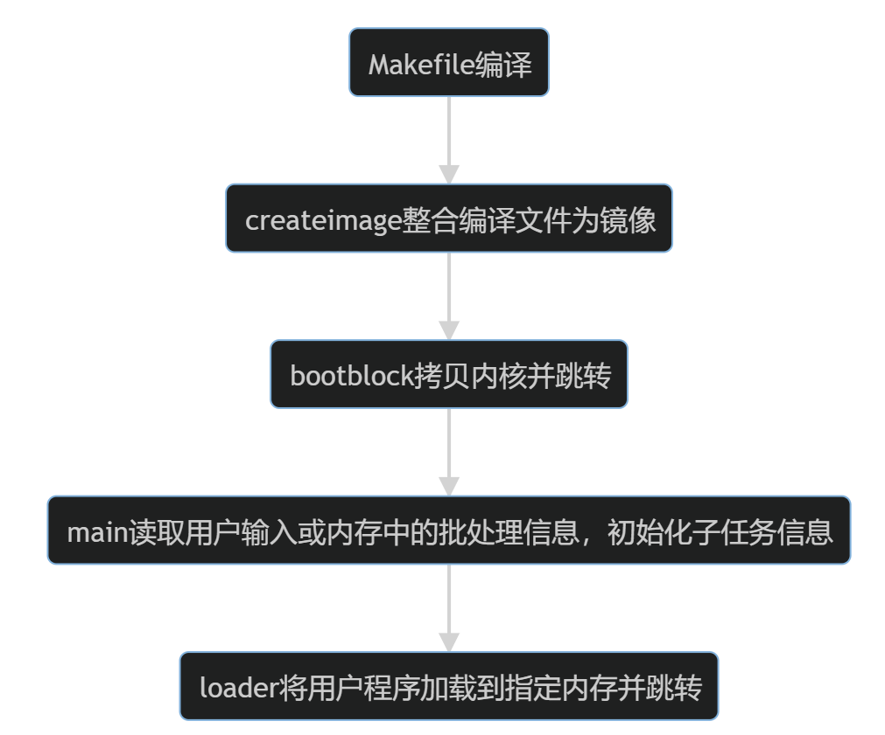

<!--_class: lead-->
# Project 1 BootLoader
## ——Design Review
### 游昆霖 2020K8009926006
---
<!--_class: lead-->
# Question1:
### Explain the code architecure of P1
---
## 关键文件列表
+ Makefile &emsp;&emsp;&emsp;&thinsp;&thinsp;编译工具，配合`riscv.lds`链接器脚本编译文件
+ createimage.c &emsp;镜像制作工具，将编译后的文件制作为镜像
+ bootblock.s &emsp;&emsp;&thinsp;引导程序，负责内核的载入和跳转
+ head.S&thinsp;&&thinsp;crt0.S &ensp;分别负责`main`和用户程序的BSS段清空与跳转
+ main.c &emsp;&emsp;&emsp;&emsp;&thinsp; 内核入口，接管`bootblock`以后的操作系统控制

+ loader.c &emsp;&emsp;&emsp;&ensp;&thinsp;装载器，负责用户程序移动到内存指定位置并执行

---
### Makefile
  + 简介：整个项目编译的工具，配合`riscv.lds`链接器脚本指定了各ELF文件的布局。其中`image`部分命令指定了运行`createimage`时的文件参数顺序，帮助我们确定了镜像的结构。编译各程序时指定的入口地址指示了该文件应当拷贝到内存的位置。
  + 功能实现：
    + task3-4中，需要作为镜像布局的信息来源；
    + task5中，需要在`image`部分加入批处理文件参数
  
---
### createimage.c
+ 简介：镜像制作工具，该程序会将编译好的`bootblock`、`main`及各用户程序整合到镜像当中，其信息的放置方式与其他程序的读取方式紧密相关。该程序仅参与镜像制作，不会参与操作系统的运行。
+ 功能实现：
  + task3中，需要将与`loader`约定好的读取方式将各程序pad到合适大小，并将kernel的扇区数记录到镜像第一个扇区的特定位置`os_size_loc`
  + task4中，需要压缩镜像，并使用用户信息扇区记录详细信息
  + task5中，需要将批处理文件的内容一同记录在用户信息扇区

---
### bootblock.S
  + 简介：这是一段大小为1个扇区（512B）的程序，在镜像制作时需要被放在启动设备的第1个扇区。系统启动时，该程序会被`loadboot`指令加载到内存`0x50200000`位置并开始执行。至此，后续操作都需要由我们编写的操作系统实现。
  + 功能实现：
    + task1中，我们只需要进行一个语句的打印。
    + task2中，需要进行内核的拷贝和跳转
    + task4中，需要加载用户信息扇区，从中读取内核信息，并移动到指定位置

---
### head.S&thinsp;&&thinsp;crt0.S
  + 简介：链接阶段，这两个文件会分别连接到内核和用户程序之前，完成BSS段清空、创建环境等准备工作。
  + 功能实现：
    + 分别需要在task2和task3中实现BSS段的清空，BSS段起止标号可以由`riscv.lds`中获得
    + task2中，`head`需要将栈指针设置到`KERNEL_STACK`位置，再跳转到主函数
    + task3中，为保证能够返回内核，需要在`crt0`的开头和结果进行ra寄存器的保存和恢复
---
### main.c
+ 简介：内核入口，在`bootblock`将其加载到内存指定位置并跳转后，会接管操作系统的所有操作，也是操作系统主要功能实现的地方。
+ 功能实现：       
  + task2中，需要实现输入的回显功能
  + task3中，需要读取用户输入的任务号进行任务调用
  + task4中，需要读取拷贝到内存的用户信息，初始化每个子任务的信息，并实现根据名字调用子任务的功能
  + task5中，需要读取镜像中的批处理文件内容进行多个子任务调用

---
### loader.c
+ 简介：装载器，由`main`进行调用，负责用户程序的拷贝、移动和调用
+ 功能实现：
  + task3中，根据约定（如镜像中内核及用户程序均15个扇区），计算程序所在的扇区号和扇区数，进行拷贝即可。
  + task4中，根据`main`中初始化的任务信息（偏移、大小等）进行扇区号和扇区数计算和拷贝，并需要前移和去尾。
  + 跳转到用户程序可以使用函数指针或者内联汇编实现
---
## 项目运行流程介绍



---
1. `Makefile`根据`riscv.lds`对各文件进行编译，并指定文件头中的内存地址信息
2. `createimage`工具将编译后的文件整合到镜像中，并将部分信息记录到第一个扇区中[task3-5]，以及制作用户信息扇区[task4-5]
3. `bootblock`在`loadboot`指令后自动执行，将内核搬运到指定位置及跳转。在[task4-5]中，需要先读取用户信息扇区获取内核信息，再进行内核拷贝。
4. `head`清空BSS段并创建栈帧，`main`函数读取拷贝到内存的用户信息[task4-5]，根据用户输入[task3-4]或批处理信息[task5]调用任务。
5. `crt0`清空BSS段并创建环境，`loader`函数根据约定[task3]或`main`函数初始化的任务信息[task4-5]将扇区拷贝到内存指定位置，并跳转执行。

---
<!--_class: lead-->
# Question2:
### How does your kernel load an 
### application and make it run?

---
## load&emsp;——TASK3
```c
int task_addr = TASK_MEM_BASE+taskid*TASK_SIZE;
int block_num = 15; //fix in task3
int block_id = 1+(taskid+1)*block_num;
bios_sdread(task_addr,block_num,block_id);
```
+ 说明：扇区大小15与`createimage`补全大小相统一，可以同时改为其他值。
---
## load&emsp;——TASK4
```c
//load task-covered sector to memory
int task_mem_addr = TASK_MEM_BASE + taskid*TASK_SIZE;
int task_block_id = tasks[taskid].entry / SECTOR_SIZE;
int task_tail_id = (tasks[taskid].entry + tasks[taskid].size) / SECTOR_SIZE;
int task_block_num = task_tail_id - task_block_id +1;
int task_entry_offset = tasks[taskid].entry - task_block_id*SECTOR_SIZE;
bios_sdread(task_mem_addr,task_block_num,task_block_id);

//move task ahead to be aligned
unsigned char * dest = (unsigned int *)task_mem_addr;
unsigned char * src = dest + task_entry_offset;
memcpy(dest,src,tasks[taskid].size);

//clear tail
dest += tasks[taskid].size;
bzero(dest,task_entry_offset);
```
---
## run
+ 方法1：函数指针
```c
void (*func)(void) = (void *)task_mem_addr;
func();
```
+ 方法2：内联汇编
```c
asm volatile ("jalr %0" : : "r"(task_mem_addr));
```

---
<!--_class: lead-->
# Question3:
### What is the structure of task_info_t in your design? How do you initialize task_info_t?
---
## Structure
```c
typedef struct {
    short entry;
    short size;
    char  name[10];
} task_info_t; //14 byte
```
+ 说明：由于镜像压缩，一个任务程序不一定从扇区头开始存储，因此需要存储其偏移量。从节省镜像空间角度考虑，只需要该任务的入口（到镜像开头的偏移）和大小就可以完全定位，在`loader`中再进行扇区信息的计算。

---
## Initialization
```c
static void init_task_info(void)
{
    // TODO: [p1-task4] Init 'tasks' array via reading app-info sector
    // NOTE: You need to get some related arguments from bootblock first
    // Init data from app-info sector(loaded into memory)
    unsigned char * ptr = (unsigned int *)USER_INFO_ADDR;
    ptr += 8;
    //tasknum is defined in task.h
    memcpy(&tasknum,ptr,2);
    ptr += 2;
    for(int i=0;i<tasknum;i++){
        memcpy(&tasks[i],ptr,sizeof(task_info_t));
        ptr += sizeof(task_info_t);
    }
}
```

--- 
<!--_class: lead-->
# Question4:
### Explain the contents and their offset 
### in your designed image file
---
## Arrangement &emsp;——TASK3
+ Sector&thinsp;0: 
  + | &thinsp;bootblock&thinsp; | &thinsp;kernel_block_num&thinsp;|&thinsp;SIG_1&thinsp;|&thinsp;SIG_2&thinsp;|
+ Sector&thinsp;1-15: 
  + |&thinsp;TASK1&thinsp;|
+ Sector&thinsp;16-30: 
  + |&thinsp;TASK2&thinsp;|
+ ...

---
## Arrangement &emsp;——TASK4
+ Sector&thinsp;0: &emsp;
  + | &thinsp;bootblock&thinsp; | &thinsp;appinfo_block_num&thinsp;|&thinsp;SIG_1&thinsp;|&thinsp;SIG_2&thinsp;|
+ Sector&thinsp;1-X(app-info):
  + |&thinsp; kernel_block_id &thinsp; | &thinsp; kernel_block_num &thinsp; |&thinsp;  kernel_entry_offset&thinsp;  | &thinsp;kernel_tail_offset &thinsp; |&thinsp;  tasknum &thinsp; | &thinsp; task_info_1 &thinsp; |&thinsp;...&thinsp;|
+ Sector&thinsp;X-End:
  + |&thinsp;TASK1&thinsp;|&thinsp;TASK2&thinsp;|&thinsp;...&thinsp;

---
## Arrangement &emsp;——TASK5
+ Sector&thinsp;0: &emsp;
  + | &thinsp;bootblock&thinsp; | &thinsp;appinfo_block_num&thinsp;|&thinsp;SIG_1&thinsp;|&thinsp;SIG_2&thinsp;|
+ Sector&thinsp;1-X(app-info):
  + |&thinsp; kernel_block_id &thinsp; | &thinsp; kernel_block_num &thinsp; |&thinsp;  kernel_entry_offset&thinsp;  | &thinsp;kernel_tail_offset &thinsp; |&thinsp;  tasknum &thinsp; | &thinsp; task_info_1 &thinsp; |&thinsp;...&thinsp;|&thinsp;bat_sz&thinsp;|&thinsp;bat_content&thinsp;|
+ Sector&thinsp;X-End:
  + |&thinsp;TASK1&thinsp;|&thinsp;TASK2&thinsp;|&thinsp;...&thinsp;


---
<!--_class: lead-->
# Question & Thought
---

+ Q&T1：程序能否在内存中连续放置？
  + 我们为什么要把任务程序从压缩的镜像中分离到内存的不同位置呢？一个原因可能是我们在编译时就已经将程序的内存位置指定到了文件头信息当中，程序的正确执行离不开这些文件信息。例如一些跳转指令中就需要知道程序的内存位置从而算出偏移。
  + 程序在内存中的紧密放置也是有可行性的。实际计算机运行中也并不会浪费那么多空白的内存空间。一种可能的将程序在内存中紧密放置的方法是在`createimage`镜像制作中，使用文件管理函数更改相关信息。另一种可能是在`Makefile`中结合`readelf`和`objdump`等指令获取文件大小从而进行紧密放置。

---
+ Q&T2：`crt0.S`中是否有必要人为创建栈帧？
  + 讲义和代码注释提示要`crt0`要负责创建和回收栈帧，创建C程序的运行时环境。我并未进行显式的创建和回收，但所有任务仍可以正常执行。
  + `head.S`为内核设置指针可能具有其必要性，一方面此时仍在于汇编的调用，还未进入C程序环境；另一方面，设置栈指针也可以利于内核和用户程序的分离。而`crt0.S`和用户程序的关系可以简单的理解为父函数和子函数的关系，使用`call`指令进行函数调用即可，运行时会进行栈帧的分配。
  + 一种可能的解释是，用户程序由内核进行调度，如果并未特别设置栈指针，其栈帧的分配和回收是基于内核栈上执行的。为了进一步实现内核和用户分离，需要进行栈指针指定。
