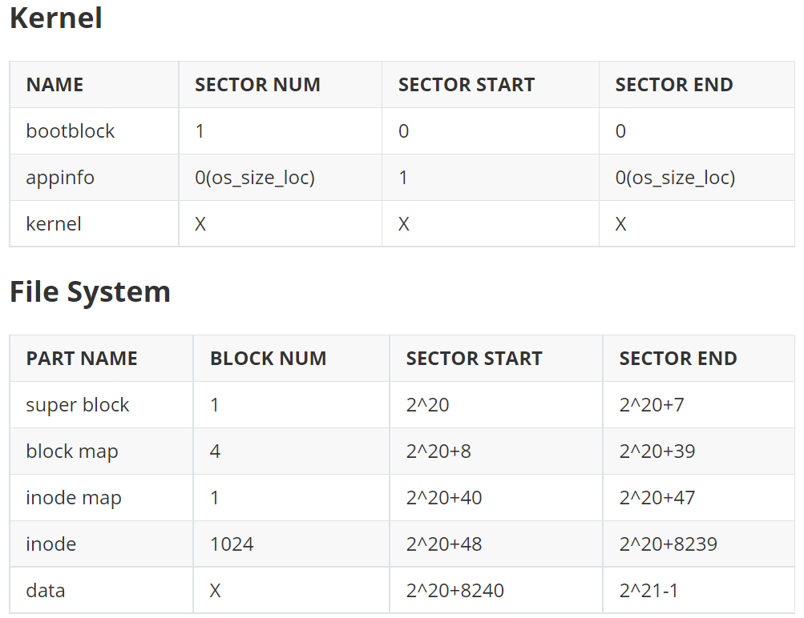

<!--_class: lead-->
# Project_6 &ensp;FileSyetem
## —— Design Review
### 游昆霖 2020K8009926006

---
<!--_class: lead-->
# Question 1: 
### What is the disk layout in your design?

---



---
<!--_class: lead-->
# Question 2:
### Show the structures of your FS metadata, 
### including superblock, inode, 
### dentry, and file descriptor

---
#### superblock
```c
typedef struct superblock{
    unsigned int magic;
    unsigned int fs_start;
    unsigned int fs_sec;

    unsigned int block_map_start;
    unsigned int block_map_sec;

    unsigned int inode_map_start;
    unsigned int inode_map_sec;

    unsigned int inode_start;
    unsigned int inode_num;
    unsigned int inode_free;

    unsigned int block_start;
    unsigned int block_num;
    unsigned int block_free;

    unsigned int inode_size;
    unsigned int dentry_size;
} superblock_t; 
```

---
#### 类别与权限
```c
typedef enum inode_type{
    I_DIR,
    I_FILE,
} inode_type_t;

typedef enum dentry_type{
    D_NULL,
    D_DIR,
    D_FILE,
} dentry_type_t;

typedef enum file_access{
    O_RDWR,
    O_RDONLY,
    O_WRONLY,
} file_access_t;
```

---
#### inode
```c
typedef struct inode{
    //标志信息
    unsigned int inode_id;
    unsigned int owner_pid;
    //类别与权限
    inode_type_t type;
    file_access_t access;
    //统计信息
    unsigned int link_cnt;
    unsigned int file_size;
    unsigned int create_time;
    unsigned int modify_time;
    //索引
    unsigned int direct[DIRECT_NUM];
    unsigned int indirect1[INDIRECT_NUM_1];
    unsigned int indirect2[INDIRECT_NUM_2];
    unsigned int indirect3[INDIRECT_NUM_3];
    //对齐补全
    unsigned int padding[7]; //padding to 128B
} inode_t;
```

---
#### dentry
```c
typedef struct dentry{
    unsigned int inode_id;
    dentry_type_t dtype;  //类别
    char name[24]; //padding to 32B
} dentry_t;
```
#### file descriptor
```c
typedef struct fdesc{
    unsigned int file_inode;
    file_access_t access;
    unsigned int used;
    unsigned int rd_offset;
    unsigned int wr_offset;
} fdesc_t;
```
---
<!--_class: lead-->
# Question 3:
### How many files and directories 
### do you file system support?

---
### 文件系统容量
+ inode map大小为4KB，每位可以对应1个inode，故总共可用inode数为32K，每个大小为128B，共占据1024个4K数据块。
+ block map大小为16KB，每位可以对应1个block，至多可以映射128K个4K大小的数据块，即512MB。考虑文件系统总块数限制，总共可用数据块数为128K-1030。
+ 综上，在没有大量大文件占用数据块的情况下，文件系统可以支持32K个文件和目录。

---
<!--_class: lead-->
# Question 4:
### What do you do when initializing a file system?

---
### 文件系统初始化与重建
+ 重置superblock并写回SD卡
+ 清空inode map并写回SD卡
+ 清空block map并写回SD卡
+ 为根目录分配inode和目录块、完成初始化并写回SD卡
+ 重置文件描述符数组（每次重启板卡也需重置）

---
### 根目录的相关初始化
+ inode初始化
  + 设置类别、权限、时间、inode号等信息
  + 将direct[0]置为自身数据块号，其余置零
+ 根目录块初始化
  + 设置临时数据块，并将其视作dentry数组。分别设置其第1、2条目录项对应本目录和父目录（对根目录，父目录也是自己），需设置类别、名字及inode号。
  + 写回SD卡，从而进行持久存储。
  
---
<!--_class: lead-->
# Question 5:
### Given an operation, for example ls /home/student,
### How do you handle path lookup?

---
### 路径分拆函数
```c
int split_path(char *path,char str[3][20]){
    int level = 0;
    int ptr = 0;
    for(int i=0;i<level;i++)
            bzero(str[i],20);
    for(int i=0;i<strlen(path);i++){
            if(path[i] == '/'){
                    str[level][ptr] = '\0';
                    ptr = 0;
                    level++;
            }
            else
                    str[level][ptr++] = path[i];
    }
    str[level][ptr] = '\0';
    level++;
    return level;
}
```

---
#### 函数功能
该函数将会将传入的字符串按照'/'分隔符进行分拆，并存入二维字符数组参数中，返回值表示路径层数。
#### 应用场景
+ 内核态：  
对于cd和ls等支持多级目录指令，分拆之后可以利用循环对每个路径参数分别操作。
+ 用户态：
shell进程在使用cd命令时，可以将多级路径分拆存储，并根据系统调用的返回值（状态码）判断分拆后的哪些路径起了实际作用，从而能够在shell中打印路径。

---
#### cd操作的状态码
+ 内核态：
  将多级目录路径传入内核态之后，会首先进行分拆，然后对每级路径依次操作。若第i级路径在当前目录块中查找到，则更改当前目录块，并将状态码二进制下最低第i位置为1。
+ 用户态：
  shell进程除了将多级目录传入内核态，本身也会进行分拆存储。逐位查看状态码各个位，如为1，表示该级路径发挥作用。将其依次与".."、"."比较，并最终确定是否增删当前路径。